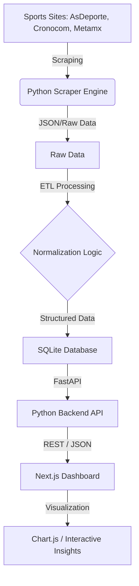

# Running Analytics Pipeline & Dashboard

[](https://vercel.com)
[](https://www.python.org/)
[](https://nextjs.org/)
[](https://fastapi.tiangolo.com/)

An end-to-end Data Engineering and Analytics project that scrapes running races results from multiple sports platforms in Mexico, normalizes the data through a robust ETL pipeline, and visualizes athlete performance metrics via a modern web dashboard.

## 🚀 Overview

This project transforms fragmented, semi-structured sports data into actionable insights.

### Key Features
- **Scalable Scraper Engine**: Modular driver-based architecture (`AsDeporte`, `CronoCom`, `MetaMX`) capable of handling diverse web structures and anti-bot measures.
- **Robust ETL Pipeline**: Automated data extraction, cleaning (normalization of times, age groups, and categories), and loading into a sqlite database.
- **Advanced Analytics**: Visual analysis of finish time distributions and athlete-performance correlations.
- **Serverless Deployment**: Full-stack integration with a FastAPI backend and Next.js frontend, optimized for Vercel.

---

## 🏗️ Architecture



### 🛠️ Tech Stack
- **Engine**: Python (Asyncio), Playwright (for dynamic content).
- **Backend**: FastAPI, SQLite, Pandas.
- **Frontend**: Next.js, Tailwind CSS, Chart.js.
- **Deployment**: Vercel (Frontend + Serverless Python Functions).

---

## 📊 Data Engineering & Analytics Depth

### 1. Data Normalization
Sports data from multiple sites are expected to arrive in inconsistent formats (e.g., `1h 20m`, `01:20:00`, or total seconds). Our pipeline includes:
- **Time Parsing**: Unified conversion of diverse string formats into `finish_time_seconds`.
- **Deduplication**: Ensuring athlete records are unique across multi-day events.
- **Feature Engineering**: Calculating `pace_seconds` (min/km) from distance and time to enable cross-race comparison.

### 2. Analytical Insights
The dashboard provides three core analytical views:
- **Performance Distribution**: Histogram showing density of runners at different time intervals, identifying "peaks" where most runners finish.
- **Demographic Split**: Breakdown of participation by Age and Gender.
- **Correlation Analysis**: Scatter plot mapping Pace vs. Age to visualize how athletic performance changes across different age groups.

---

## 💻 Installation & Usage

### Prerequisites
- Python 3.10+
- Node.js 20+
- npm

### 1. Scraper & ETL
```bash
# Install dependencies
pip install -r requirements.txt

# Run the scraper
python main.py

# Run the ETL pipeline to process data into the webapp database
python etl/pipeline.py
```

### 2. Web Dashboard
```bash
vercel dev --cwd webapp
```

---

## 🚀 Deployment

The project is configured for **Vercel**. 
- **Root Directory**: `webapp`
- **Framework**: Next.js
- **API**: The Python backend is automatically served via Vercel's `@vercel/python` runtime (defined in `webapp/vercel.json`).

---
